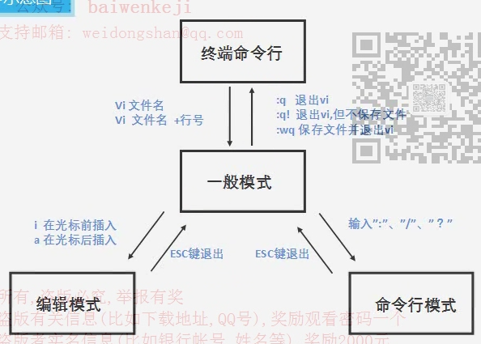

1. **VI编辑器的三种模式**

   

   1. 一般模式（光标移动、复制、粘贴、删除）

   2. 编辑模式（编辑文本）

   3. 命令行模式（查找和替换）

2. **vi编辑器的配置**

   ```
   cd /etc/vim
   cp vimrc ~/.vimrc
   cd ~
   gedit .vimrc
   在.vimrc中加入如下内容：
   
   "关闭兼容功能
   set nocompatible 
   "显示行号
   set number
   "编辑时 backspace 键设置为2个空格
   set backspace=2
   "编辑时 tab 键设置为4个空格
   set tabstop=4
   "设置自动对齐为4个空格
   set shiftwidth=4
   "搜索时不区分大小写
   set ignorecase
   "搜索时高亮显示
   set hlsearch
   ```

3. **vi常用命令汇总**

   1. 打开文件<br>vi    filename

   2. 退出/保存文件<br>:w      保存文件<br>:wq    保存并退出<br>:q!      强制退出vi，即使文件被修改，也不保存该文件

   3. 进入编辑模式<br>i     在光标前插入文本<br>a    在光标后插入文本<br>o    在当前行之下新开一行，并到行首<br>O   在当前行之上新开一行

   4. 光标移动

      1. 多行间切换<br>ctrl + f                向前滚动一整屏<br>ctrl + b               向后滚动一整屏<br>gg                       转到文件开头<br>G                        转到文件结尾<br>ngg/nG              光标移到第n行的行首/行尾<br>n+/nj                  光标向下移动n行<br>n- /nk                 光标向上移动n行<br>

      2. 单行列切换<br>0          光标移到当前行行首<br>$          光标移到当前行行末<br>h/nh    光标向左移动1/n列<br>l/nl       光标向右移动1/n列<br>w          光标移动支下一字的开头<br>b           光标移动到上一字的开头 <br>fx          搜索当前行中下一个出现字母x的地方<br>Fx         搜索当前行中上一个出现字母x的地方

   5. 文本粘贴<br>使用p键<br>如复制当前行，先用yy复制当前行，切换到目的行的上一行后，用p来粘贴所复制的行<br>如剪切当前行，先用dd复制当前行，切换到目的行的上一行后，用p来粘贴所复制的行

   6. 撤消命令<br>使用u键来撤消上一步操作（undo）

   7. 查找及替换命令<br>/pattern                      从光标处开始向文件尾搜索pattern，后按下n或N（n: 在同一个方向上重复<br>                                     上一次的搜索命令，N：在反方向上重复上一次的搜索命令）<br>?pattern                      从光标开始处向文件首部搜索pattern，后按下n或N<br>:s/p1/p2/g                  将当前行中所有的p1用p2替换<br>:s/p1/p2/gc                替换时需要确认<br>:n1,n2s/p1/p2/g        将n1到n2行中所有的p1用p2替换<br>:n1,n2s/p1/p2/gc      替换时需要确认<br>:%s/p1/p2/g               将文件中所有的p1用p2替换<br>:%s/p1/p2/gc             替换时需要确认

   8. 文本复制<br>yy      复制当前行<br>nyy    复制当前行及其后的 n -1 行

   9. 文本删除<br>x/X                  删除光标后/前的一个字符<br>nx/nX              删除光标后/前的n个字符<br>dw/db            从光标处删到当前词尾/首<br>d0/(d$/D)       从光标处删到行首/尾<br>dd/ndd           删除光标所在行/当前行及其后的 n - 1 行


